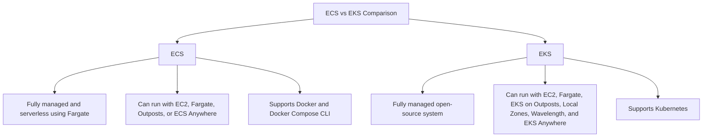

# Compute Technology and Services
- [EC2](#ec2)
- [Containers](#containers)
    - [Containers Overview](#containers-overview)
    - [ECS vs EKS](#ecs-vs-eks)
    - [Quick Quiz!](#containers-quick-quiz)
    - [Exam Tips](#containers-exam-tips)
- [Serverless](#serverless)
    - [What is Serverless?](#what-is-serverless)
    - [Lambda Overview](#lambda-overview)
        - [Lambda Use Cases](#lambda-use-cases)
    - [Faragate Overview](#faragate-overview)
        - [Faragate Use Cases](#faragate-use-cases)
    - [Exam Tips](#serverless-exam-tips)
- [Serveless Pricing](#serveless-pricing)
    - [Lambda Pricing](#lambda-pricing)
    - [Fargate Pricing](#fargate-pricing)
    - [Exam Tips](#serveless-pricing-exam-tips)
- [Additional Compute Services](#additional-compute-services)
    - [Outposts](#outposts)
    - [Lightsail](#lightsail)
    - [Batch](#batch)
    - [Wavelegth](#wavelegth)
    - [Quick Quiz!](#additional-compute-services-quick-quiz)
    - [Exam Tips](#additional-compute-services-exam-tips)

---

<p align="center">
    <a href="https://docs.aws.amazon.com/ec2/index.html" style="margin: 0 10px;">
        
    </a>
    <a href="https://docs.aws.amazon.com/AmazonECS/latest/developerguide/Welcome.html" style="margin: 0 10px;">
        
    </a>
    <a href="https://docs.aws.amazon.com/AmazonECR/latest/userguide/what-is-ecr.html" style="margin: 0 10px;">
        
    </a>
    <a href="https://docs.aws.amazon.com/eks/latest/userguide/what-is-eks.html" style="margin: 0 10px;">
        
    </a>
    <a href="https://docs.aws.amazon.com/lambda/" style="margin: 0 10px;">
        
    </a>
    <a href="https://docs.aws.amazon.com/AmazonECS/latest/userguide/what-is-fargate.html" style="margin: 0 10px;">
        
    </a>
    <a href="https://docs.aws.amazon.com/outposts/" style="margin: 0 10px;">
        
    </a>
    <a href="https://docs.aws.amazon.com/lightsail/index.html" style="margin: 0 10px;">
        
    </a>
    <a href="https://docs.aws.amazon.com/batch/index.html" style="margin: 0 10px;">
        
    </a>
    <a href="https://docs.aws.amazon.com/wavelength/index.html" style="margin: 0 10px;">
        
    </a>
</p>


## EC2
- **Connecting to EC2:** <a href="https://docs.aws.amazon.com/AWSEC2/latest/UserGuide/AccessingInstancesLinux.html" title="Connecting to EC2">
        
    </a>
    - AWS Management Console
    - EC2 Instance Connect (EIC)
    - Secure Shell (SSH) and Remote Desktop Protocol (RDP)
    - AWS Systems Manager

## Containers
### Containers Overview**
- **What are containers?** - Containers are a standard unit of software that packages up code and all its dependencies so the application runs quickly and reliably from one computing environment to another.
- **Benefits of containers**
        - Portability
        - Operational consistency
        - Efficiency
        - Application development
        - less overhead
- **Use cases for containers**
    - "Lift and shift" applications
    - Refactoring applications
    - Support for microservices architecture
    - Support for CI/CD deployment
    - Easier deployment of repetitive tasks
## Containers on AWS
- **Amazon Elastic Container Service (ECS)** 
    <a href="https://docs.aws.amazon.com/AmazonECS/latest/developerguide/Welcome.html" title="Amazon Elastic Container Service (ECS)">
        
    </a>
- **Amazon Elastic Container Registry (ECR)** 
    <a href="https://docs.aws.amazon.com/AmazonECR/latest/userguide/what-is-ecr.html" title="Amazon Elastic Container Registry (ECR)">
        
    </a>
- **Amazon Elastic Kubernetes Service (EKS)** 
    <a href="https://docs.aws.amazon.com/eks/latest/userguide/what-is-eks.html" title="Amazon Elastic Kubernetes Service (EKS)">
        
    </a>

    

### ECS vs EKS



**Elastic Container Service (ECS):**
- Fully managed and serverless using Fargate
- Can run with EC2, Fargate, Outposts, or ECS Anywhere
- Supports Docker and Docker Compose CLI

**Elastic Kubernetes Service (EKS):**
- Fully managed open-source system
- Can run with EC2, Fargate, EKS on Outposts, Local Zones, Wavelength, and EKS Anywhere
- Supports Kubernetes

### Containers Quick Quiz!
#### **You need to use Docker to manage your newly deployed container-based application. Which AWS service can help you manage the app?**
<details>
  <summary>Answer</summary>
    <b>Elastic Container Service (ECS)</b>
</details>

### Containers Exam Tips
- **Know**: The differences between **Elastic Container Service** and **Elastic Kubernetes Service**.
- **Understand**: When you would use container: **"Lift and shifts"**, **microservices architecture**, **CI/CD**, and **refactoring applications**.

## Serverless
### What is Serverless?
- **Serverless** is a cloud computing model that allows you to build and run applications and services without thinking about servers.
### Lambda Overview
- AWS Lambda is a serverless compute service that lets you run code without provisioning or managing servers. What you write in Lambda is called a **Lambda function**. Can use a lot of languages like Node.js, Python, Ruby, Java, Go, .NET Core, and custom runtime. Lambda scales automatically, and you pay only for the compute time you consume.

#### Lambda Use Cases
- Real-time file processing - Lambda can process files as uploaded to S3.
    - **Example**:
        ```mermaid
            graph LR;
                A[S3] -- file upload triggers --> B[Lambda]
                B -- processes and stores data in --> C[DynamoDB]
        ```
- Sending notifications - Lambda can send notifications to users via email, SMS, or push notifications.
    - **Example**:
        ```mermaid
            graph LR;
                A[CodeCommit] -- triggers --> B[CloudWatch]
                B -- invokes --> C[Lambda]
                C -- sends notification to --> D[SNS]
                D -- delivers notification to --> E[Email]
        ```
- Backend Business Logic - Lambda can be used to run backend business logic for web and mobile applications.
    - **Example**: 
        ```mermaid
            graph LR;
                J[Alexa Skill] -- sends request to --> K[Lambda]
                K -- sends data to --> L[DynamoDB]
                L -- retrieves data for --> K
                K -- responds to --> J
        ```

### Faragate Overview
- **AWS Fargate** is a serverless compute engine for containers that works with both **Elastic Container Service (ECS)** and **Elastic Kubernetes Service (EKS)**. Fargate allows you to run containers without having to manage the underlying infrastructure.

#### Faragate Use Cases
- **Message-Driven Workloads** - Fargate can process messages from a queue.
    - **Example**:
        ```mermaid
            graph LR;
                A[SQS] -- sends message to --> B[Fargate]
                B -- processes message and stores data in --> C[DynamoDB]
        ```
- **Event-Driven Workloads** - Code scanned for sensitive information like account numbers or credentials.
    - **Example**:
        ```mermaid
            graph LR;
                A[CodeCommit] -- commits trigger --> B[Lambda]
                B -- triggers task on --> C[Fargate]
                C -- sends notifications to --> D[SNS]
        ```
# Lambda vs Fargate
- **Overview:**
    - The key difference between Fargate and Lambda lies in their intended use cases. Lambda is designed for short-lived, event-driven workloads, while Fargate is suitable for long-running, persistent workloads. If you need to run a process that takes more than 15 minutes, you should use Fargate.

        | Service | Time Limit |
        |---------|------------|
        | <a href="https://docs.aws.amazon.com/lambda/" title="Lambda"></a> **Lambda** | < 15 minutes |
        | <a href="https://docs.aws.amazon.com/AmazonECS/latest/userguide/what-is-fargate.html" title="Fargate"></a> **Fargate** | > 15 minutes |


### Serverless Exam Tips
- **Know**: Your responsibility when **using serverless services** like ** Lambda**
- **Understand**: **Fargate** is considered **serverless**, and is used to manage containers.

## Serveless Pricing
### Lambda Pricing
- **Number of requests**: You are charged based on the number of requests for your functions.
- **Duration**: You are charged based on the time it takes for your code to execute.
- **No charge**: You are not charged if your code is not running.
- **Free tier**: 1 million requests per month.

### Fargate Pricing
- **No upfront costs**: You pay only for the vCPU and memory you use.
- **Pay resources**: You pay for the resources you use per second.
- **No free tier**: Fargate has no free tier.

### Serveless Pricing Exam Tips
- **Know**: **Lambda** has an **always Free tier** that includes **1 million** requests per month.
- **Understand**: **Fargate** has no **upfront costs**. Pay only for the **resources used**.

## Additional Compute Services

### Outposts 
<a href="https://docs.aws.amazon.com/outposts/" title="AWS Outposts">
    
</a>

- **AWS Outposts** is a fully managed service that extends AWS infrastructure, services, and tools to virtually any data center, co-location space, or on-premises facility for a consistent hybrid experience.

### Lightsail 
<a href="https://docs.aws.amazon.com/lightsail/index.html" title="AWS Lightsail">
    
</a>

- **Amazon Lightsail** is the easiest way for developers needing virtual private servers to start with AWS. Lightsail includes everything you need to launch your project quickly - a virtual machine, SSD-based storage, data transfer, DNS management, and a static IP - for a low, predictable price.

### Batch 
<a href="https://docs.aws.amazon.com/batch/index.html" title="AWS Batch">
    
</a>

- **AWS Batch** enables developers, scientists, and engineers to easily and efficiently run hundreds of thousands of batch computing jobs on AWS. AWS Batch dynamically provisions the optimal quantity and compute resources (e.g., CPU or memory-optimized instances) based on the volume and specific requirements of the batch jobs submitted.

### Wavelength 
<a href="https://docs.aws.amazon.com/wavelength/index.html" title="AWS Wavelength">
    
</a>

- **AWS Wavelength** brings AWS services to the edge of the 5G network, minimizing the latency of connecting to an application from a mobile device. Wavelength embeds AWS compute and storage services at the edge of telecommunications providers' 5G networks.


### Additional Compute Services Quick Quiz!
#### **You need to select a service to implement a quick deployment of a small temporary test environment. What service can you use to accomplish this?**
<details>
  <summary>Answer</summary>
    <b>Lightsail</b> is perfect for quick launches of small projects like test environments or preconfigured WordPress websites.
</details>

#### **You must suggest a service allowing your data to reside in your data center and support a hybrid deployment model. What can you use to do this?**
<details>
  <summary>Answer</summary>
    <b>Outpost</b> provides low latency and meets data residency or sovereignty regulations while supporting a hybrid deployment model.
</details>

### Additional Compute Services Exam Tips
- **Outposts** support hybrid deployment models.
- **Lightsail** is a compute service used to **quickly launch small projects**.
- **Batch** is a compute service that processes **large workloads** in **smaller batches**.
- **Wavelength** allows users to reach application servers **without leaving** the **5G mobile network**.